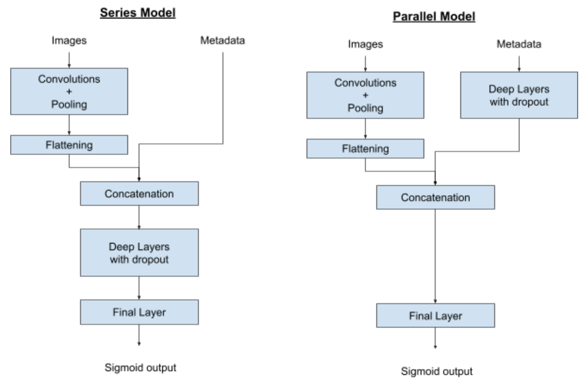

# Skin Cancer Detection with 3D-TBP using a CNN (ISIC 2024 Contest)
**Contest link:** https://www.kaggle.com/competitions/isic-2024-challenge

# ► I. Introduction

This project takes color images of skin lesions and growths and applies a convolutional neural network (CNN) to determine if the lesion is malignant or benign. The images are accompanied by metadata containing the target value (1 = malignant, 0 = benign) and other information. The data is highly unbalanced, with 393 malignant samples compared to 400666 benign. Data augmentation is performed on the Target = 1 samples. Feature selection is performed on the metadata.  

Two CNNs are examined: in-series and in-parallel models. The in-series model starts with convolutional layers, then concatenates the metadata before running a full neural network. The in-parallel model runs the metadata through a neural network in parallel with the convolutional layers, then concatenates the outputs before a final layer. In addition, a hair removal algorithm is examined, which alters the image inputs. Each model is run with and without hair removal to determine the better approach. The model structures are as follows:

# ► II. The interest of the project

Skin cancer is a frequent form of cancer that can be deadly if not caught early. A model capable of determining if lesions are malignant would be useful in prefiltering patients before consultation with a specialist.

# ► III. How to Install and Run the Project

## A. Installation

### *Prerequisites:*
1.	Python 3.11.9 environment
2.	IDE with Jupyter Notebook extension
3.	Conda (for environment creation)
4.	AWS CLI configured with appropriate permissions to access S3 and SageMaker
5.	Terraform for Infrastructure as Code (IaC) to provision AWS resources
   
### *Files:*
***Supplied***
-	EDA.ipynb : Jupyter notebook containing the exploratory data analysis, data cleaning, feature selection, and preprocessing of metadata
-	Model.ipynb : Jupyter notebook containing the CNN model. Data augmentation is performed here.
-	hdf5_write.ipynb : code that generates a subset of metadata and images (optional)
-	requirements.txt : packages to be installed via pip in Conda
-	deploy.yml: Automation file for structured deployment and workflow management
-	main.tf: Terraform file defining the infrastructure (SageMaker instances, S3 bucket, IAM roles, etc.)

***On the Kaggle competition website (see link at top of readme)***  
*Note 1: Inscription required. The data has non distribution clauses.*  
*Note 2: "train" here is specific to Kaggle. They have hidden validate and test datasets that our code does not use.*
-	train-image.hdf5 : file containing all the images
-	train-metadata.csv : metadata file

***Generated by EDA.ipynb***
-	cleaned-metadata.csv : the cleaned metadata file generated by EDA.ipynb and used by Model.ipynb

***Generated by Model.ipynb***
-	model_results_save.csv : Save of metrics calculated during all the epochs
-	test_ids.csv : Save of test_ids 
-	test_results_save.csv : Save of test target class, probability predictions, and predicted class
-	Model_Epoch_?.weights.h5 (? = Epoch number) : Save of model weights at the end of an epoch. The save frequency can be set.
-	Model_Last_Epoch.weights.h5 : Save of model weights after all Epochs.

***Generated by hdf5_write.ipynb***
- sample-image.hdf5
- sample-metadata.csv

## B. Making the code functional:
After completing the installation, the code will be functional after the following steps:
-	Place all ipynb files in the same directory
-	Place all csv and hdf5 files in a subdirectory to store input data ("/data" for example)
-	Create a new subdirectory for the save files ("/saves" for example)
#### EDA.ipynb:
-	At top of code in section titled "Create directory paths for the project", update the dataPath variable with the path for directory where the *train-metadata.csv* and *train-image.hdf5* files are stored.
-	In same section, adjust the file names if necessary
#### Model.ipynb:
-	In section 2.1, update the dataPath variable with the path for directory where the *cleaned-metadata.csv* and *train-image.hdf5* files are stored.
-	In same section, update the savePath variable with the path for directory where model outputs will be saved.
-	In same section, adjust the file names if necessary.
#### hdf5_write.ipynb (optional):
- At top of code, declare the filepaths and filenames.

## C. Run order:
The *EDA* notebook must be run first. It generates a cleaned metadata file used by the *Model* notebook. The *hdf5_write* notebook is optional and can be run on either the train-metadata.csv or cleaned-metadata.csv files to create a smaller, more manageable version that can be used with the other notebooks.

# ► IV. Details on project notebooks
## A. Using EDA.ipynb
The EDA file takes a couple hours to run in general.  
- Input files:
  - train-image.hdf5
  - sample-metadata.csv  
- Output files:
  - cleaned-metadata.csv

The EDA has multiple purposes. The unmodified metadata images are examined, including basic statistical parameters and the number of NAs. Some example images are printed to see what exactly the model will be dealing with. Different image augmentation algorithms are examined, with image printing to demonstrate them. Feature cleaning and normalization/standardization are performed. Then feature selection is performed, using 3 different models: Random Forest, Logistic Regression, and XGBoost. The final selected features are chosen manually, using the results from these models as a guide. Finally, the selected features are output into a file. This file contains isic_id, target, and cleaned features. It is the metadata input to Model.ipynb.

## B. Using Model.ipynb:
The Model file is highly parametrizeable. A single run can take many hours or several minutes, depending on user selections (number of batches, sample size, hair removal, etc.). This will be detailed later.  
- Input files:
  - train-image.hdf5
  - cleaned-metadata.csv
- Output files:
  -	model_results_save.csv : Save of metrics calculated during all the epochs
  -	test_ids.csv : Save of test_ids 
  -	test_results_save.csv : Save of test target class, probability predictions, and predicted class
  -	Model_Epoch_?.weights.h5 (? = Epoch number) : Save of model weights at the end of an epoch. The save frequency can be set.
  -	Model_Last_Epoch.weights.h5 : Save of model weights after all Epochs.

The Model has several main features: generation of train/validate/test lists, hair removal/image augmentation, metadata dictionary creation (speeds up code), dataset creation (generator or loading in RAM), model definition, model fit, model test, and exportation of results/weights.

### i) Generation of train/validate/test lists
The data is very unequilibrated, with very few target = 1 results. The following measures are used to ensure more equilibrated data:
1. Make two separate lists of isic_ids for target=0 and target=1. Transform into tuples (isic_id, target, mod toggle). Base data has mod toggle = 0, meaning no adjustment will be made.
2. Reserve 10% of target = 1 for validate
3. Split into train-validate & test on both lists (0 and 1). Take the test lists (0 and 1), concatenate and shuffle them
4. Create augmentation preparation function for target = 1: mod toggle = strictly positive integer (this adds more isic_ids to the list, with mod toggle non zero))
5. Run augmentation preparation function on train-validate and the reserved validation data: mod toggle = strictly positive integer
6. Split train-validate on both lists (0 and 1)
7. Reduce the validation data on target = 0 by value specified in reduce_frac
8. Concatenate and shuffle the train lists and validation lists
9. Limit training and validation data to speed up training (take only fraction of prepared lists)

### ii) Hair removal / Image augmentation:
Hair removal is applied to all images when it is activated. Augmentations are applied to Target = 1 samples in the validation data and, to a lesser extent, the training data.

The following primary augmentation functions are used:
- flip right-left
- flip up-down
- rotate 90° / 180° / 270°
- random cutout (black rectangle added to image in random position)

Additional augmentations are applied on top of the primary augmentations (some are left alone). These additional augmentations are:
- Brightness increase / decrease
- Saturation increase / decrease
- Contrast increase / decrease

### iii) Metadata dictionary creation
Querying of a dictionary is very fast in Python. Thus, all main data is placed in a dictionary. The dictionary is queried by iterating through a list that contains the keys. A dataset is generated by iterating through the list one by one. A shuffle of the list translates into a shuffling of the data set.

### iv) Dataset creation
The tensorflow dataset structure is a practical way to prepare data for a neural network. Datasets are created for train, validate, and test splits. Batching and prefetching are used on all the datasets. Two approaches are used to create these datasets:
- On demand: data is not stored in memory, it is accessed when needed via a generator
- Preload into RAM: data is stored in memory. This takes time, but allow for extremely fast data access during the neural network calculations.

Both train and validate data can use both methods. Test data only uses the on demand method (the generator is only called twice).

### v) Model definition
Two models are defined. Only one is run. The user must select the desired model in advance. The models are:
- In series: Convolutional layers are followed by a concatenation with metadata and then a NN.
- In parallel: Convolution layers are run in parallel to a metadata NN, followed by concatenation then a final layer.

### vi) Test predictions
The model is used to predict the target values of test data. A number of metrics are calculated here.

### vii) Exportation of results/weights
These are exported by default. Only the exportation of weights can be deactivated with a simple toggle.

### viii) Toggles
A number of toggles are provided at the top of the code. They allow:
- Taking fewer samples from train, validate, and test data.
- Saving datasets in RAM (validate data in memory is suggested, while train data in memory usually proves problematic)
- Weights export saving frequency
- Train-validate-test parameters
- Image resizing (all images must have the same size before being fed to the NN)
- Hair removal
- Batch sizes
- Neurons and dropout in deep layers of the NN
- Learning rate
- Number of epochs
- Early break (end early if the validation loss has an increasing trend)
- Cheat... add the target to the metadata! This is ONLY for debugging.

For fast verifications, the following is useful:
- train_frac_to_use = 0.01
- val_frac_to_use = 0.01
- test_frac_to_use = 0.3
- save_train_in_memory = False
- save_val_in_memory = False
- apply_hair_removal = False
- nb_epochs = 1

# ► V. System requirements (minimum)
Operating system: Windows, macOS, Linux 
GPU: not required, but much preferred (see Tensorflow for supported GPUs) 
CPU: 4-core, modern 
RAM: 8GB (16GB *usually* allows for validation data to be stored in memory)

# ► VI. Server instances
The model has been tested on AWS SageMaker linked to an S3 bucket, with the input and output files stored in the S3 bucket. The preferred architecture for fast training is: 
•	Instance type: ml.g5.2xlarge (1 GPU NVIDIA A10G, 8 vCPU, 32GB RAM)
•	Storage: Amazon S3 for data and artifact storage.

# ► VII. Deployment

 ## Deployment Architecture
The project is deployed using Amazon Web Services (AWS) with the following architecture:
1.	AWS SageMaker : Used to run Jupyter notebooks for model training, with scalable instances that support GPU for faster training.
2.	Amazon S3 : Stores input datasets and model artifacts (weights and metrics), which SageMaker can access directly.
3.	Instance Type : The model training is optimized on the ml.g5.2xlarge(not free) instance type, which provides GPU support to reduce the computation time for complex deep learning tasks.

## Deployment Process
The entire deployment process is automated through the deploy.yml file, which orchestrates the workflow and executes each step seamlessly.
1.	Data Preparation:
o	The deploy.yml file includes the step to upload train-image.hdf5 and train-metadata.csv to an S3 bucket (e.g., images-projet-deep-learning-01) (or you can do it manually before the pipeline starting)
2.	Environment Setup:
o	The deploy.yml file manages the launch of a SageMaker instance (e.g., ml.g5.2xlarge), configured with the necessary IAM roles to access the S3 bucket.
3.	Model Training:
o	Model.ipynb is executed to train the CNN model on SageMaker. Data is retrieved from S3, and model weights are periodically saved back to S3.
4.	Model Testing and Evaluation:
o	After training, the deploy.yml file orchestrates model testing, saving evaluation metrics to model_results_save.csv and predictions to test_results_save.csv, both stored in S3.
5.	Inference (Optional):
o	For real-time inference, a SageMaker endpoint can be configured, or batch processing jobs can be run using the trained model weights stored in S3.

# ► VIII. Credit
The primary project was created by: 
-	Claire Davat
-	Wilfried Cédric Koffi Djivo
-	Martial Kouassi
-	Andrew Wieber
